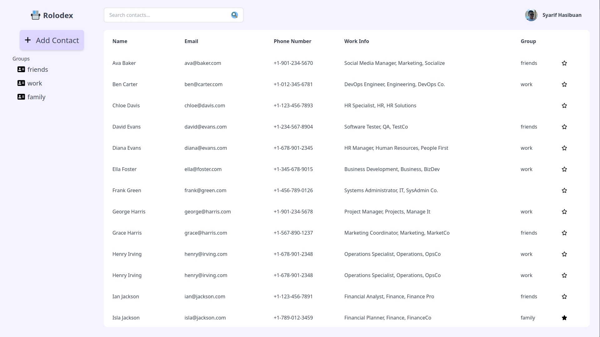

# ROLODEX

A simple address book website that showcase programmer's javascript skill.
Access it at: [rolodex.syarifhasibuan.dev](https://rolodex.syarifhasibuan.dev)

## Inspiration

The projects take inspiration from these websites:

-   [Google Contacts](https://contacts.google.com)
-   [Budi Gunawan's Charm](https://charm.budigunawan.com)
-   [Aziz Ramdan's Address Book](https://bearmentor-address-book.azizramdan.id)

## Features

-   Static contact list
-   Search contact by all parameter
-   Shortcut key to focus on search bar
-   Show favorite in an icon
-   Highlight the contact that you are hovering
-   Sort by name alphabetically
-   Add new contact
-   Search by group
-   Contact detail page
-   Creation info with relative moment from now

## Preview

## Todos

-   [x] Sidebar content
-   [x] Fix table row scrolling overlap with sticky header
-   [x] Search form
-   [x] Profile icon on the right top
-   [x] Favorite button
-   [x] "Add contact" link to /new
-   [x] Search the whole contact field instead of just name
-   [x] Change cursor to click cursor when hovering over a row
-   [x] Favorites will be shown first
-   [x] Click contact show detail of the contact
-   [x] Contact detail page
-   [x] Click on favorite button will toggle the favorite
-   [ ] Edit contact form
-   [ ] Fix the new contact page form to be more readable
