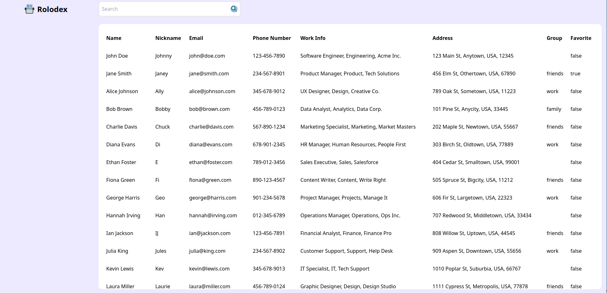

# ROLODEX

A simple address book website that showcase programmer's javascript skill.
Access it at: [Rolodex](https://rolodex.syarifhasibuan.dev)

## Inspiration

The projects take inspiration from these websites:

-   [Google Contacts](https://contacts.google.com)
-   [Budi Gunawan's Charm](https://charm.budigunawan.com/)
-   [Aziz Ramdan's Address Book](https://bearmentor-address-book.azizramdan.id/)

## Feature

-   Static contact list
-   Search contact by all parameter
-   Shortcut key to focus on search bar
-   Show favorite in an icon
-   Highlight the contact that you are hovering

## Preview

## Todo

-   [ ] Add sidebar content
-   [ ] Fix table row scrolling overlap with sticky header
-   [x] Add search functionality
-   [x] Add profile icon on the right top
-   [x] Add favorite star button
-   [ ] Add "Add contact" button
-   [ ] Add edit button
-   [x] Search the whole contact field instead of just name
-   [ ] Click on favorite star button will toggle the favorite
